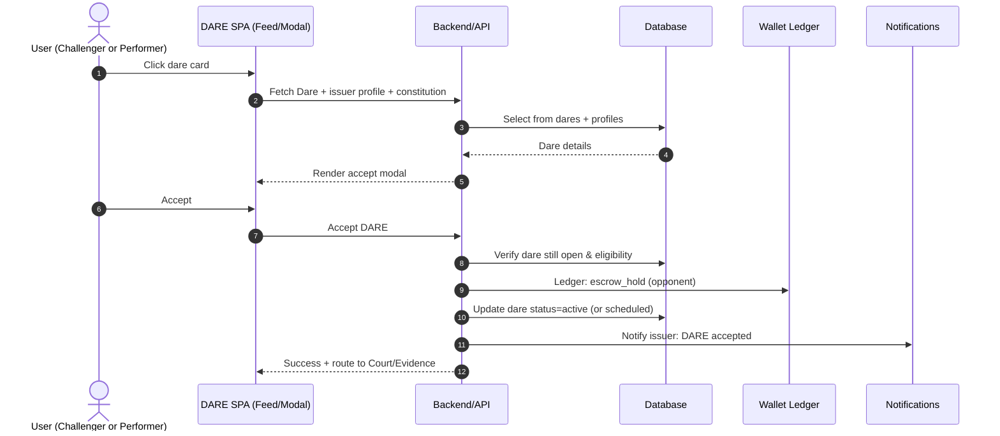
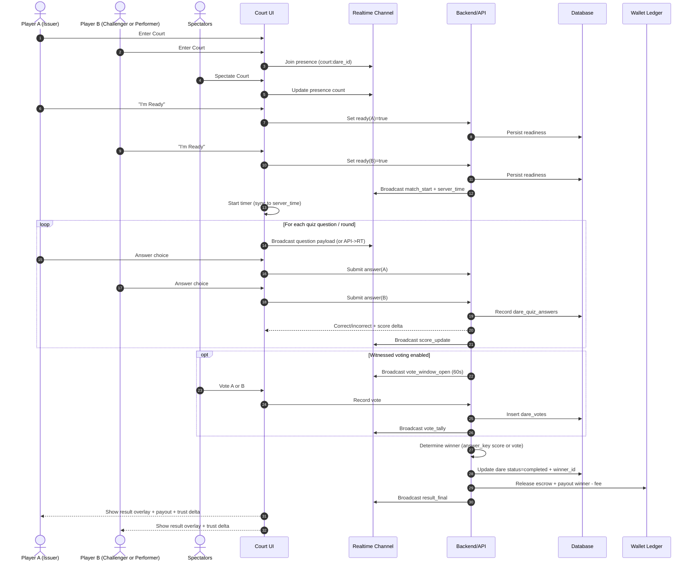
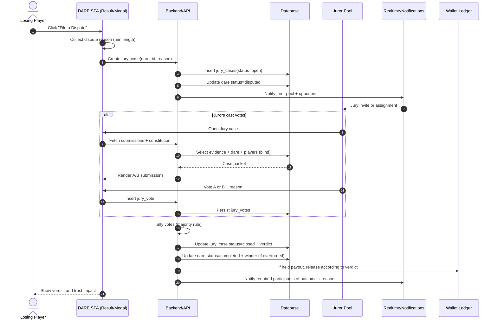
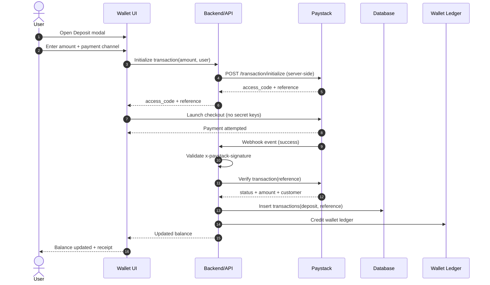
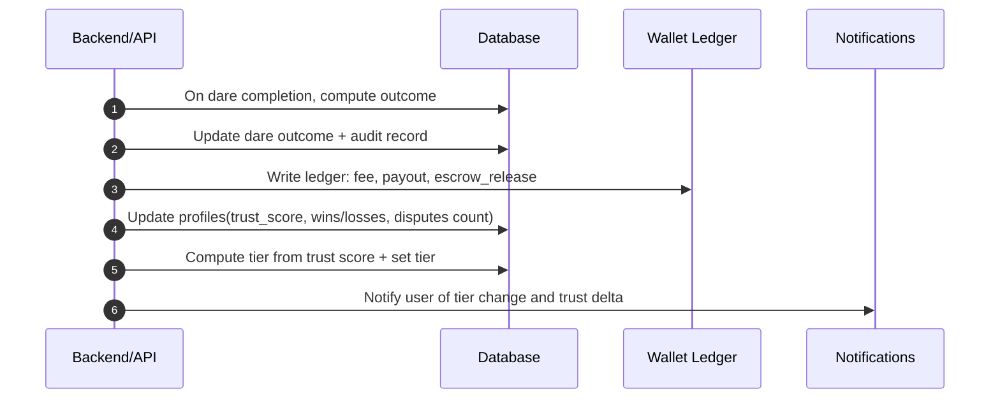
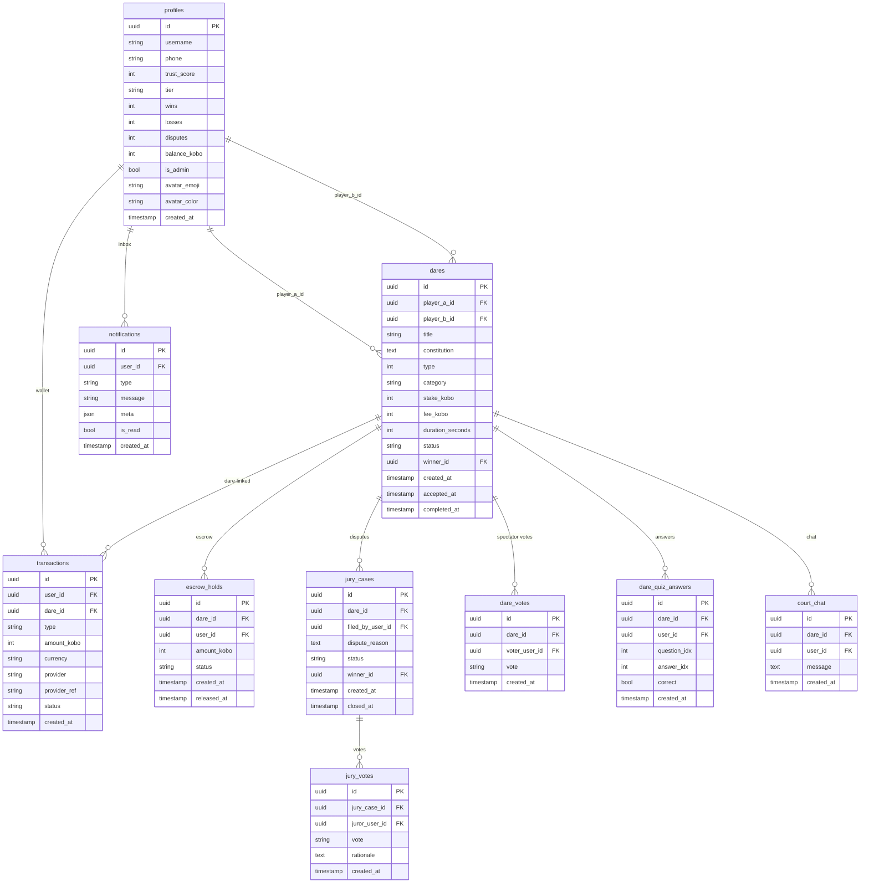

# Deep Technical & Product Analysis of the DARE Single‑Page App Prototype

## Executive summary

Product alignment note: this report analyzes the historical prototype. Production DAREs are creator-authored and use the model in `docs/16-dare-resolution-model.md`: Skill-Based DAREs lock both participants' stakes, Task-Based DAREs lock only the Darer-funded reward, and resolution is `answer_key`, `witnessed`, or `evidence`.

The attached `index.html` is a **single‑page app (SPA) prototype** that already encodes a fairly complete “money‑backed competition” product model: authenticated users browse a **DARE Feed**, issue challenges through a **five‑step “constitution” wizard**, accept/decline challenges via a modal, participate in a **live “Court”** experience (real‑time score/timer, quiz panel, vote panel, proof/dispute actions, chat), and manage funds via a **wallet with deposit/withdraw** modals and a **win/loss result overlay**. It also contains scaffolding for **tournaments (“Arena”)**, a **jury system** page (populated dynamically), notifications, and an admin risk view.

From a backend perspective, the JavaScript is built around a **Supabase‑style data model** (tables referenced include `profiles`, `dares`, `transactions`, `notifications`, `jury_cases`, `jury_votes`, `dare_votes`, `dare_quiz_answers`, `court_chat`), with flows that imply **escrow ledgering**, **state transitions** on dares, and **event‑driven notifications**. Real‑time features are heavily implied (chat, votes, readiness, live counts), mapping naturally to broadcast/presence patterns like those supported by entity["company","Supabase","database platform"] Realtime (broadcast/presence/Postgres changes). citeturn0search1

The big non‑technical constraint is regulatory and payments risk. DARE’s core loop (entry fee + prize payout on contest outcome) is **functionally within “gaming / games of skill with entry fee and prize”** and therefore intersects with:  
- payment processor policy (notably entity["company","Paystack","payments company"] treats “gambling, gaming … including games of skill … with an entry fee and a prize” as restricted unless you obtain **prior approval** and operate only where permitted), citeturn3search0  
- Nigerian anti‑money laundering obligations (e.g., the Money Laundering (Prevention and Prohibition) Act includes cash‑limit rules and CDD expectations), citeturn17view0  
- Nigeria’s data protection framework (Nigeria Data Protection Act, breach notice within 72 hours and cross‑border transfer controls), citeturn14view1turn14view2  
- and Nigeria gaming/lottery/betting licensing reality, which is **state‑centric** after the Supreme Court invalidated the National Lottery Act’s nationwide effect (except FCT), pushing licensing complexity into each state’s regime (e.g. entity["organization","Lagos State Lotteries and Gaming Authority","lagos state, nigeria"] positioning itself as regulator in Lagos; PwC analysis of the Supreme Court verdict). citeturn6view0turn1search0turn2search3

The roadmap therefore must treat “payments + licensing + fraud controls + dispute resolution integrity” as first‑class MVP requirements, not later refinements. Paystack also strongly recommends server‑side transaction initialization and verification (and webhook signature validation), which implies a minimal backend even if most app logic is in Supabase. citeturn0search5turn0search0

---

## Prototype overview and conceptual model

### What the prototype “is” as a product

Based purely on the UI and the JS/state scaffolding, the prototype implements a **challenge economy**:

- **DARE object**: a challenge with a title (“The Test”), type (answer_key / witnessed / evidence), category, duration, stake, rules/constitution, and state.
- **Primary participant roles**: Darer/Issuer, Skill-Based Challenger, and Task-Based Performer.
- **Funds model**: wallet balance, escrow concept, deposits and withdrawals, and automatic settlement payouts (plus platform fee/rake implied by the stake/reward calculator UI).
- **Resolution model**: different DARE types imply different adjudication:
  - answer_key scoring (quiz/interactive outcomes),
  - witnessed voting,
  - evidence submission leading to jury decision,
  - jury/admin escalation for disputed outcomes.
- **Integrity model**: trust score/tier presentation and admin “collusion pattern detected” messaging imply a reputation and fraud‑monitoring layer.

### Real‑time, multi‑party mechanics implied

The Court page combines multiple concurrent streams of state:

- match clock / timer and “urgent” animation state
- score for each side
- quiz question delivery and answer collection
- spectator voting and vote counts
- chat messages and viewer count
- readiness/confirmation before starting
- proof submission and dispute routing

This maps closely to broadcast + presence patterns (e.g., “who is watching”, “vote tallies update now”), which Supabase Realtime explicitly supports. citeturn0search1

---

image_group{"layout":"carousel","aspect_ratio":"16:9","query":["Supabase Realtime broadcast presence diagram","Paystack webhook signature x-paystack-signature header example","Lagos State Lotteries and Gaming Authority logo","Nigeria Data Protection Act 2023 official gazette cover"],"num_per_query":1}

## UI component, page, modal, widget, and flow catalog

The table below catalogs the interactive surface area present in `index.html`. “State/data required” is inferred from DOM IDs (dynamic containers) and referenced data tables in the script.

> Legend: “DB” means persisted state (Supabase tables implied). “Client” means front‑end state variables (e.g., `currentUser`, `challengeData`, `courtTime`, etc.). “RT” means real‑time channel state (chat/votes/presence).

| Component | Location | Purpose | Primary interactions | State/data required |
|---|---|---|---|---|
| Auth overlay | Global (`#authOverlay`) | Entry point; login/register | Switch tabs; submit login/register; quick selection | Client: auth form fields; DB: `profiles`; auth session |
| Login form | Auth overlay | Authenticate returning users | Submit credentials | Auth provider + profile lookup |
| Register form | Auth overlay | Create user profile | Enter name/phone/password; select specialty/categories | DB: create `profiles`; initialize wallet fields |
| App shell | Global (`#appShell`) | Houses SPA layout post‑auth | Navigation; logout | Client: `currentPage`, `currentUser` |
| Sidebar brand block | Shell | Branding + persistent identity | None (static) | None |
| Sidebar user block | Shell (`#sidebarName`, `#sidebarAva`) | Shows user identity/tier | Click profile nav | DB: `profiles` fields (username, tier, avatar) |
| Sidebar navigation | Shell | Page routing | Click nav items → `nav(page)` | Client: `currentPage`; route metadata |
| Sidebar balance widget | Shell | Show wallet balance and escrow | Click wallet page | DB: balance; escrow total; `transactions` |
| Topbar | Shell | Context title + utilities | Notifications button; refresh | Client: page metadata; DB: unread notifications |
| Toast | Global (`#toast`) | Lightweight feedback | Auto‑hide; show messages | Client: transient message state |
| Result overlay | Global (`#resultOverlay`) | Post‑match outcome & payout | Close; dispute; go to feed/jury | DB: payout transaction; trust score delta |
| Feed page | `#page-feed` | Discovery/home | Filters; open dare; refresh; CTA issue dare | DB: `dares`, `profiles` (leaderboard), `notifications` |
| Filter bar | Feed | Filter dares by state/category | Select filter chips | Client: active filter; DB query params |
| Feed cards container | Feed (`#feedCards`) | List dares (dynamic) | Click card → open accept/spectate/result | DB: `dares` joined to `profiles` |
| “Top Players” widget | Feed | Leaderboard view | Click player row → profile | DB: `profiles` ordered by trust score |
| “Live Now” widget | Feed (`#liveWidget`) | Shows live dares | Click live item → court/spectate | DB/RT: active dares; presence |
| Feed CTA (“Issue a DARE”) | Feed sidebar | Shortcut into creation | Button → create page | None beyond routing |
| Create page | `#page-create` | 5‑step constitution builder | Next/back; set fields; submit | Client: `challengeData`; DB: create `dares` |
| Stepper (“Type/Define/Stakes/Rules/Review”) | Create | Progress + validation metaphor | Step advance/regress | Client: `createStepNum` |
| Type selection cards | Create Step 1 | Choose resolution mechanism | Select type; gating on tier | Client: `challengeData.type`; DB: user tier/trust |
| Category picker grid | Create Step 1 | Set category | Select category pill | Client: `challengeData.category` |
| Definition fields | Create Step 2 | Enter test description, proof method | Text input; toggles | Client: title/description/proof_required |
| Target participant selection | Create Step 2 | Make dare open or targeted | Select target participant / open | Client: target participant state |
| Duration selector | Create Step 2 | Court duration | Pick duration | Client: `challengeData.duration_seconds` |
| Stake input + quick buttons | Create Step 3 | Set stake size | Enter amount; quick pick | Client: stake; DB: wallet balance check |
| Stake calculator | Create Step 3 | Show fee + payout preview | Auto updates on stake | Client calc; server should compute canonical fee |
| Rules editor | Create Step 4 | Define constitution rules | Textarea | Client: rules text; DB: constitution blob |
| Review + Issue | Create Step 5 | Confirm and create dare | Submit; show confirmation | DB: insert into `dares`; create escrow holds |
| Accept DARE modal | `#acceptDareModal` | Review constitution & accept | Accept/decline; counter (if supported) | DB: dare detail; wallet lock; notifications |
| Deposit modal | `#depositModal` | Fund wallet | Choose payment method; amount; confirm deposit | DB: `transactions` (deposit); payment provider flow |
| Withdraw modal | `#withdrawModal` | Withdraw wallet funds | Enter amount; bank details; submit | DB: withdrawal request; payout provider |
| Court page | `#page-court` | Live match arena | Ready confirm; quiz answers; vote; chat; submit proof; dispute | RT: votes/chat/presence; DB: dare status, quiz answers |
| Court header + timer | Court | Match state visibility | Start/stop via flow | Client: `courtTime`; server authoritative clock recommended |
| Player panels | Court | Show A/B identity + score | Answer quiz; score increments | DB: `profiles`; Client: `courtScoreA/B` |
| Quiz panel | Court (`#courtQuizPanel`) | Answer Key scoring mechanism | Select option → mark correct/wrong | DB: `dare_quiz_answers` |
| Vote panel | Court (`#courtVoteSection`) | Witnessed/social resolution | Cast vote; see count | DB/RT: `dare_votes`; eligibility gating |
| Proof panel | Court (`#courtProofPanel`) | Evinced resolution entry point | Submit proof; open dispute flow | DB: proof references; `jury_cases` |
| Court details drawer | Court (`#courtDetailsExpanded`) | Shows constitution metadata | Toggle expand/collapse | DB: dare constitution |
| Live chat | Court | Social layer | Send message; viewer count | RT/DB: `court_chat`; presence |
| Jury page | `#page-jury` (`#juryContent` dynamic) | Blind review & voting hub | View submissions; vote; reasons | DB: `jury_cases`, `jury_votes`, evidence objects |
| Arena page | `#page-arena` | Tournament scaffolding | View bracket; host tournament modal | DB: tournaments + matches (not fully modeled) |
| Bracket viewer | Arena (`#bracketSection`) | View tournament bracket | Open/close | DB: bracket structure |
| Create tournament modal | `#createTournamentModal` | Configure tournament | Set title/prize/date | DB: tournament entities |
| Wallet page | `#page-wallet` | Balance + transactions | Deposit/withdraw; view escrow; metrics | DB: `transactions`, escrow holds |
| Notifications page | `#page-notifs` | Inbox for system events | Mark read; navigate to item | DB: `notifications` |
| Profile page | `#page-profile` | Identity + stats | Edit profile; view history | DB: `profiles`, `dares` history |
| Admin page | `#page-admin` | Operational risk view | Inspect disputes/flags | DB: disputes, flags, analytics |

### Flow inventory present as first‑class UI

- Issuing a dare: 5‑step builder → issue.
- Joining a dare: feed card → accept modal → escrow lock → Court or evidence flow.
- Court match: ready → play timer+quiz; optionally vote; result overlay.
- Dispute: “File a dispute” flow appears and routes to Jury page.
- Wallet: deposit/withdraw; escrow visibility.
- Notifications: appear for disputes and other events.
- Tournament: “view bracket” and “host tournament” scaffolding.

---

## Detailed user journeys with sequence diagrams

The diagrams below describe the user journeys as the product *should* work to be production‑safe. Where the prototype uses client‑side logic, the sequence assumes you move canonical steps (escrow, payouts, trust score changes) to **server‑validated** transactions.

### Issuing a dare via five‑step constitution builder

```mermaid
sequenceDiagram
  autonumber
  actor U as User (Issuer)
  participant SPA as DARE SPA (Create)
  participant API as Backend/API
  participant DB as Database
  participant WAL as Wallet Ledger
  participant N as Notifications

  U->>SPA: Navigate to Create
  SPA->>SPA: Step 1: select type + category
  SPA->>SPA: Step 2: define test + proof method + duration + target participant
  SPA->>SPA: Step 3: set stake; show fee/payout preview
  SPA->>API: Validate stake/reward vs wallet balance
  API->>DB: Read wallet balance & limits
  DB-->>API: Balance + tier limits
  API-->>SPA: OK / insufficient funds / tier restriction
  alt insufficient funds
    SPA->>SPA: Prompt deposit
  end
  SPA->>SPA: Step 4: write rules (constitution)
  SPA->>SPA: Step 5: review
  U->>SPA: Issue DARE
  SPA->>API: Create DARE + lock issuer stake or Darer reward
  API->>DB: Insert DARE (status=open/awaiting_participant)
  API->>WAL: Create ledger entry: escrow_hold (issuer)
  API->>N: Notify targeted participant (if any)
  API-->>SPA: Dare created + reference
  SPA-->>U: Confirmation + link in Feed
```

### Joining a dare



### Live match flow in Court

This sequence includes quiz answering, voting, chat, timer, and resolution.



### Dispute filing and jury resolution

The prototype reuses the Accept modal infrastructure for disputes; operationally, disputes must become auditable cases.



### Wallet deposit and payout

Deposit must be server‑initiated and verified (Paystack explicitly warns against using a secret key in the frontend, and recommends verifying amount/status). citeturn0search5turn0search2



Payouts for winnings should be ledgered internally first (reduce risk), then batched via transfer APIs (Paystack Transfers/Recipients). citeturn4search0turn4search1

### Reputation changes and tiering



---

## Backend requirements, data model, and scaling architecture

### Core backend capabilities implied by the prototype

Even if you keep “app logic” in Supabase, DARE still requires:

- **Authoritative transaction/escrow ledger** (double‑entry or event‑sourced ledger preferred).
- **Dare state machine** (open → accepted → active → completed/disputed → settled).
- **Real‑time channels** for Court and Jury updates (broadcast + presence patterns map cleanly to Supabase Realtime). citeturn0search1
- **Payments backend** that:
  - initializes Paystack transactions server‑side, citeturn0search2turn0search5
  - validates webhook signatures, citeturn0search0
  - verifies transaction amount/status before crediting value, citeturn0search5turn0search8
  - and performs payouts via transfer/recipient APIs. citeturn4search0turn4search1
- **Evidence storage** (the companion doc suggests object storage; a common implementation is S3‑compatible storage like Cloudflare R2). citeturn4search2turn4search5
- **Moderation/fraud pipeline** (collusion flags, dispute abuse flags, multi‑account detection).

### API surface (suggested)

A production‑safe API set (these can be REST endpoints, Supabase Edge Functions, or a gateway service):

- Auth/profile
  - `GET /me`
  - `PATCH /profiles/me`
- Dares
  - `POST /dares` (create)
  - `POST /dares/{id}/accept`
  - `POST /dares/{id}/decline`
  - `POST /dares/{id}/ready`
  - `POST /dares/{id}/submit_answer`
  - `POST /dares/{id}/vote`
  - `POST /dares/{id}/submit_proof`
  - `POST /dares/{id}/complete` (server only)
- Jury/disputes
  - `POST /dares/{id}/disputes` (create jury case)
  - `GET /jury_cases/{id}`
  - `POST /jury_cases/{id}/votes`
  - `POST /jury_cases/{id}/close` (server only)
- Wallet/payments
  - `POST /wallet/deposit/init`
  - `POST /wallet/withdraw/request`
  - `POST /webhooks/paystack`
  - `POST /payouts/batch` (ops)
- Notifications
  - `GET /notifications`
  - `POST /notifications/mark_read`

### ER diagram (baseline)

The tables below align with what the prototype references directly, plus minimal additions for escrow integrity and auditability.



### Event flows and real‑time needs

**High‑importance event flows (should be immutable and audit‑logged):**
- `deposit_succeeded` → wallet credit
- `dare_created` → optional opponent notification
- `dare_accepted` → escrow hold creation (both sides) → dare becomes active/scheduled
- `court_started` → start time anchored to server time
- `answer_submitted` → score update (if answer_key)
- `vote_cast` → vote tally update (if witnessed)
- `dare_completed` → payouts + trust score updates
- `dispute_filed` → jury case open
- `jury_vote_cast` → vote tally internal
- `jury_case_closed` → final settlement

**Real‑time surfaces present in the prototype:**
- Court chat messages (fan‑out to all viewers)
- Presence count (“watching”)
- Vote count updates
- Score updates
- State transitions (ready, countdown, match start, match end)

Supabase Realtime supports broadcast/presence semantics appropriate for these. citeturn0search1  
If using Supabase, prefer **broadcast‑driven business events** with server‑generated payloads for scalability and trust boundaries (especially for scoring and payout gating).

### Security requirements and “trust boundary” corrections

Key security constraints implied by Paystack documentation and typical escrow platforms:

- **Never expose payment secret keys client‑side**; transaction init/verify must be server‑side. citeturn0search5turn0search2
- **Webhook verification**: validate `x-paystack-signature` (HMAC SHA512) and/or IP allow‑listing, before crediting wallet or settling payouts. citeturn0search0
- **Idempotency**: webhook handlers must be idempotent (same provider reference should not create duplicate credits).
- **Ledger immutability**: credits/debits should be append‑only ledger entries, not mutable “balance = …” updates.
- **RLS / authorization**: for Supabase tables, enforce row‑level security so that:
  - only participants can see dare details pre‑public,
  - only jurors see jury packets,
  - only admins see fraud flags,
  - only the wallet owner can see transaction history.
- **Anti‑tamper for evidence**: evidence recording needs server-stamped sessions and storage checksums; object storage should be private with signed URLs and short TTL (R2 supports S3-compatible patterns and emphasizes strong security properties like non-discoverable buckets/randomized URLs). citeturn4search4turn4search2

---

## Legal, regulatory, and fraud risks with mitigations and compliance checkpoints

### Payments platform risk and eligibility

The most immediate “launch blocker” risk is payment acceptance.

Paystack’s Acceptable Use Policy explicitly treats **gambling, gaming, and activities with entry fees and prizes (including games of skill)** as restricted unless you obtain prior approval and operate only where legal. citeturn3search0  
Paystack also flags “betting businesses” and “lottery and online gaming businesses” as categories that may be ineligible for international transactions or require extra scrutiny. citeturn3search2

**Mitigation checkpoints**
- Before production deposits: secure **written Paystack approval** for this business model (and confirm the exact category they will classify you under). citeturn3search0turn3search2
- Implement **geo‑fencing** and jurisdiction controls if you cannot legally operate everywhere you can technically accept payments.
- Treat “DARE coins” carefully: if they become transferable or redeemable, they may be characterized as stored value / e‑money depending on structure (requires specialist counsel).

### Nigerian gambling / gaming / lottery licensing complexity

Nigeria’s gaming/lottery regulatory landscape became materially more complex after the Supreme Court decision that invalidated the National Lottery Act’s nationwide application (except the Federal Capital Territory), reinforcing state authority over lotteries and gaming. citeturn6view0turn2search3  
In Lagos specifically, the Lagos State Lotteries and Gaming Authority describes itself as empowered to regulate lottery and gaming in Lagos State, including online sports betting and related categories. citeturn1search0turn1search10

**Mitigation checkpoints**
- Define whether DARE is:
  - a gambling/betting operator,
  - a promotional competition,
  - or a skill competition facilitator.  
  The “entry fee + prize pool + platform rake” pattern often pushes regulators toward gaming classification.
- Establish a jurisdiction strategy:
  - start with a single state (e.g., Lagos) and comply with its licensing requirements first,
  - or partner with an already‑licensed operator (where legally permissible) to operate under their license umbrella.
- Maintain a compliance register mapping:
  - “Where can users participate?”
  - “Where can you pay out?”
  - “Where is the operator deemed to operate (server location vs user location)?”  
  (PwC’s note highlights uncertainty around online operators and how states may interpret “operating within a state.”) citeturn6view0

### KYC/AML obligations and suspicious activity monitoring

The Money Laundering (Prevention and Prohibition) Act, 2022 includes:
- cash payment limitations (₦5,000,000 for individuals; ₦10,000,000 for corporates for cash payments outside financial institutions), citeturn17view0  
- international transfer reporting thresholds (>$10,000 transfers to/from foreign countries reported within one day to relevant bodies), citeturn17view0  
- and customer identification / beneficial owner expectations for financial institutions and designated non‑financial businesses and professions. citeturn17view0  

The Nigerian Financial Intelligence Unit’s role is to receive suspicious transaction reports and threshold transaction reports from reporting entities. citeturn5search3  
FATF standards and guidance emphasize risk‑based AML controls and CDD/record‑keeping/STR reporting expectations, including sector‑specific guidance for casinos (useful analog for real‑money gaming). citeturn5search9turn5search0

**Mitigation checkpoints**
- Implement KYC tiers (light → full) aligned with stake limits and withdrawal thresholds.
- Add fraud and AML monitoring rules:
  - velocity: many deposits/withdrawals quickly
  - circular transfers: “win trading” patterns
  - large cross‑border flows
  - multi‑account device clusters
- Create audit trails and retention policies for financial records.

### Privacy and data protection compliance

Nigeria Data Protection Act, 2023 imposes:
- **personal data breach handling** expectations, including notifying the Commission within **72 hours** of becoming aware of a breach likely to result in risk to individuals and communicating high‑risk breaches to affected data subjects. citeturn14view1turn16view1
- cross‑border transfer restrictions: you may not transfer personal data out of Nigeria unless adequate protection conditions are met or another statutory basis applies, and you must record the basis. citeturn14view2turn16view2
- children’s data expectations: controllers must obtain parent/guardian consent and apply mechanisms to verify age and consent (with specific mention of ID documents as an appropriate mechanism). citeturn16view0turn14view0

**Mitigation checkpoints**
- Draft privacy notices and consent flows covering:
  - participant data
  - spectators and chat logs
  - video evidence/streams
  - automated decisioning (trust score, fraud flags)
- Establish breach response runbooks aligned to the 72‑hour requirement. citeturn14view1turn16view1
- Implement age gating and under‑18 controls; note that Lagos regulator communications emphasize underage gaming prohibitions as part of responsible gaming messaging. citeturn1search11

### Fraud and abuse risk landscape for DARE

DARE’s economics (rake + escrow + peer competition) creates predictable attack classes:

- **Collusion / win‑trading:** two accounts repeatedly play low‑friction dares to launder money or farm trust score.
- **Multi‑account / sybil:** create many spectator accounts to influence witnessed votes.
- **Chargeback and payment disputes:** users attempt to reverse deposits after losing, or claim unauthorized payments (Paystack has chargeback/dispute flows you must operationalize). citeturn4search6turn4search3
- **Evidence manipulation:** edited videos, pre‑recording, replay attacks, screen‑recording instead of in‑app capture.
- **Jury capture:** bribing jurors, collusive juror rings, or intimidation.
- **Denial-of-service / harassment:** chat abuse, spectator brigading.

**Mitigations**
- Graph‑based collusion detection (shared devices, IP clusters, repeated matchups, abnormal win‑rates).
- Spectator eligibility rules (account age, prior participation, trust score thresholds) and “follow‑graph concentration” checks.
- Jury selection constraints (no prior relationship; randomized assignment; rate limits; delayed visibility of peer votes).
- Strong evidence capture controls (device attestation, server-stamped recording sessions, watermarking, and integrity checks) for real Evidence adjudication before launch.

---

## MVP roadmap, milestones, effort/risk, and success metrics

### MVP framing

Your prototype includes multiple challenge types (answer_key/witnessed/evidence) and tournaments. A risk-optimized MVP should ship the three approved resolution modes first, backed by strong payments, dispute handling, and fraud controls. Given Paystack restrictions, licensing complexity, and evidence integrity challenges, each mode needs conservative limits and auditability:

- **Answer Key** for creator-authored objective prompts with committed answers.
- **Witnessed** for live audience/witness signals.
- **Evidence** for proof submission with jury/admin review.

### Roadmap table

| Milestone | Deliverables | Dependencies | Effort | Risk | Success metrics |
|---|---|---|---|---|---|
| Compliance & payments readiness | Paystack approval; jurisdiction policy; ToS/Responsible Gaming; KYC/AML tier design | Legal counsel; Paystack compliance review | Medium | Very high | Approval obtained; payment flows accepted; regulator stance clarified |
| Secure wallet + ledger foundation | Double‑entry ledger; deposit verification; withdrawal request queue; audit trails | Paystack server integration; webhook validation | High | High | <0.1% ledger inconsistencies; webhook idempotency proven |
| DARE core (create + accept + escrow) | Create/accept APIs; dare state machine; escrow holds on accept | Wallet ledger | High | High | Create→accept conversion; escrow locked correctly 100% |
| Resolution engine v1 | Support answer_key, witnessed, and evidence modes | Product decision; storage if evidence | High | High | Dispute rate; resolution time; user satisfaction |
| Jury + dispute hardening | Jury assignment; blind packets; vote tally; escalation | Identity/KYC tiers; moderation tooling | Medium | High | Time to verdict; juror participation completion rate |
| Real‑time Court layer v1 | Chat; presence; vote/score broadcast; reconnect handling | Realtime infra | Medium | Medium | Latency p95 under target; no desync issues |
| Fraud & risk instrumentation | Collusion rules; multi‑account detection; velocity limits; admin console | Analytics + ledger | Medium | High | Reduced suspicious activity; manual review throughput |
| Growth & retention loop | Notifications; streaks; leaderboard; referrals | Stable core system | Medium | Medium | D7 retention; % users completing first dare |

---

## UI/UX and product critique with recommended improvements

### Strengths visible in the prototype

- **Clear information architecture:** Feed → Create → Court → Wallet → Profile/Notifications. This matches the real user mental model for a wagered contest platform.
- **Constitution metaphor is strong:** forcing structure (type, stakes, rules) reduces ambiguity and supports dispute/jury workflows.
- **High‑energy visual language:** consistent dark theme, strong status badges, and high‑contrast emphasis for “live / urgent.”

### Improvement opportunities

**Trust boundary clarity**
- The UI communicates escrow and payout, but users will need:
  - explicit explanation of **when funds lock** and **when they release**
  - a transparent fee breakdown (platform rake + payment fees)
  - a “settlement timeline” panel: “instant / within 30 seconds / within 24h.”

**Dispute UX**
- The dispute modal should:
  - show the exact consequence (e.g., dispute fee, trust penalty if frivolous)
  - explain what evidence is admissible, and the timeline
  - show whether payout is paused or already settled (and what reversal means)

**Spectator voting integrity**
- If voting is used, “min viewers” alone is insufficient. Add visible eligibility signals:
  - “Eligible voters: N”
  - “Voting closes in: …”
  - “Accounts created <7 days cannot vote” (or similar)

**Evidence capture**
- If the evidence model is core, the prototype needs a dedicated flow for:
  - in‑app capture
  - retake rules
  - upload progress
  - submission receipt + immutable hash
  before you rely on “proof panel” actions.

**Wallet and responsible gaming**
- Add spend controls:
  - daily deposit limits
  - cooling‑off / self‑exclusion toggle
  - prominent “18+ only” and responsible gaming messaging  
  This aligns with regulator expectations around underage gaming restrictions and responsible gaming posture. citeturn1search11

---

## Telemetry, analytics events, and KPIs

### Suggested analytics event taxonomy

Events should be structured, consistent, and joinable across user/session/dare/payment IDs.

**Acquisition & onboarding**
- `auth_register_started`, `auth_register_completed`
- `kyc_started`, `kyc_completed`, `kyc_failed`
- `first_deposit_initiated`, `first_deposit_succeeded`

**DARE creation funnel**
- `dare_create_viewed`
- `dare_create_step_completed` (step=1..5, include validation errors)
- `dare_created` (type, category, stake, targeted/open)

**Join funnel**
- `dare_viewed`
- `dare_accept_clicked`
- `dare_accepted`
- `dare_declined`

**Court engagement**
- `court_entered` (role=player/spectator)
- `court_ready_confirmed`
- `court_question_seen`, `court_answer_submitted` (correct flag)
- `court_vote_cast`
- `court_chat_message_sent`
- `court_match_completed`

**Economy**
- `wallet_deposit_initiated`, `wallet_deposit_verified`, `wallet_deposit_failed`
- `wallet_withdraw_requested`, `wallet_withdraw_paid`, `wallet_withdraw_rejected`
- `escrow_hold_created`, `escrow_released`
- `payout_initiated`, `payout_succeeded`, `payout_failed`

**Disputes and jury**
- `dispute_filed`
- `jury_invite_received`, `jury_opt_in`, `jury_vote_cast`
- `jury_case_closed`

**Integrity & enforcement**
- `fraud_flag_raised` (rule_id)
- `account_limited`, `account_suspended`

### KPI set aligned to the business model

- **Activation:** % of new users who (a) deposit, (b) issue a dare, (c) accept a dare, within 7 days.
- **Liquidity:** average active open dares per DAU; time‑to‑match (open → accepted).
- **Economics:** gross volume (GMV), rake revenue, payout volume, chargeback rate. (Paystack dispute/chargeback operational readiness matters here.) citeturn4search6turn4search3
- **Integrity:** dispute rate, dispute upheld rate, jury completion time, collusion flags per 1,000 matches.
- **Retention:** D1/D7/D30 retention by cohort, and by tier.
- **Trust score health:** distribution over time, “score inflation” indicator, ban rate, false positive rate.
- **Operational reliability:** webhook processing latency, real‑time p95 latency, payout failure rate.

---

## Primary‑source compliance references

- entity["company","Paystack","payments company"] guidance: keep secret keys server‑side; verify transaction status and amount; prefer webhooks. citeturn0search5turn0search2turn0search8  
- Paystack webhook signature verification (`x-paystack-signature`, HMAC SHA512). citeturn0search0  
- Paystack acceptable use restrictions for gambling/gaming and “games of skill with entry fee and prize” unless prior approval. citeturn3search0  
- entity["organization","FATF","intergovernmental org"] Recommendations (global AML/CFT standard) and sector guidance for casinos (useful analog). citeturn5search9turn5search0  
- Money Laundering (Prevention and Prohibition) Act, 2022 (Nigeria Gazette PDF): cash limits; international transfer reporting; customer identification duties. citeturn17view0  
- Nigeria Data Protection Act, 2023 (Gazette PDF): breach notification within 72 hours; cross‑border transfer rules; children consent verification. citeturn14view1turn14view2turn16view0  
- Nigeria gaming regulatory landscape (post‑Supreme Court decision) summarized by PwC; Lagos regulator positioning. citeturn6view0turn1search0turn2search3  
- Real‑time service patterns: Supabase Realtime broadcast/presence capabilities. citeturn0search1  
- Evidence storage option: entity["company","Cloudflare","internet infrastructure company"] R2 is S3‑compatible and emphasizes zero egress fees (useful for video evidence economics). citeturn4search2turn4search5
